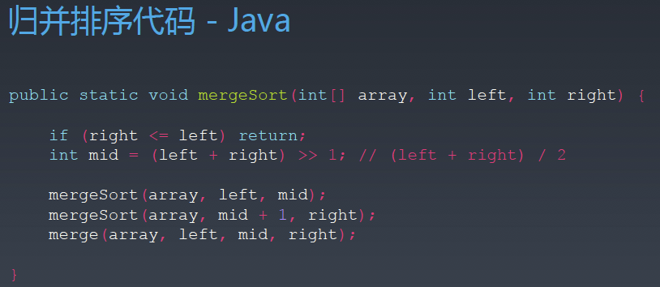

# 第九周学习总结

## 1. 布隆过滤器

### 1.1. 定义

一个很长的二进制向量和一系列随机映射函数，可以用于检索 一个元素是否在一个集合中，不同于哈希表，布隆过滤器不存储额外数据，所以查询效率更高，空间效率和时间效率都远远优于一般算法。

## 2. LRU Cache (Least Recently Used Cache)

### 2.1. 特性

- 采用哈希表+双向链表的数据结构实现
- 读写操作均为O(1)

## 3. 排序算法

### 3.1. 算法分类

- 比较类排序：通过比较来决定元素间的相对次序，由于其时间复杂度不能突破O(nlogn)，因此也称为非线性时间比较类排序。
- 非比较类排序：不通过比较来决定元素间的相对次序，它可以突破基于比较排序的时间下界，以线性时间运行，因此也称为线性时间非比较类排序。

### 3.2. 个算法复杂度对比

### 3.3. 快排模板

### 3.4. 归并排序模板

